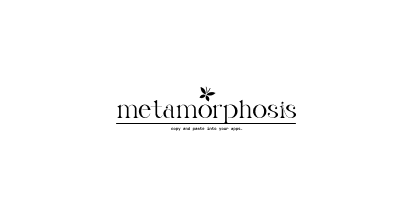

# Metamorphosis UI

<div align="center">
  <h3>A modern and accessible React component library</h3>
</div>

<div align="center">
  
</div>

<div align="center">
  <a href="https://www.npmjs.com/package/metamorphosis-ui">
    
  </a>
  <a href="LICENSE">
    
  </a>
</div>

## Features

- 🎨 Modern and clean design
- ♿️ Accessible components
- 🎯 Type-safe with TypeScript
- 🎭 Customizable with Tailwind CSS
- 📱 Responsive components
- 🚀 Easy to use and integrate

## Installation

```bash
npm install metamorphosis-ui
```

<div align="left" style="display: flex; flex-direction: column; gap: 8px;">
    <a href="COMPONENTS.md">📚 Components Documentation</a> 
    <a href="CONTRIBUTING.md">🤝 Contributing Guidelines</a> 
    <a href="LICENSE">📜 License</a> 
</div> 